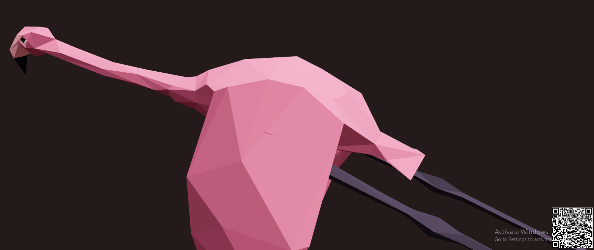

# MVP Arquitetura Frontend

Este repositório contém a aplicação frontend desenvolvida em React para a aplicação MVP Arquitetura.

## Sumário

- [Instalação](#instalação)
- [Configuração](#configuração)
- [Uso](#uso)
- [Docker](#docker)
- [API externa](#api)


## Instalação

### Pré-requisitos

- Node.js 14+
- npm ou yarn

### Passos

1. Clone o repositório:

```bash
git clone https://github.com/DDFaller/MVP_Arquitetura_Front.git
cd MVP_Arquitetura_Front
```

2. Instale as dependências:

```bash
npm install
# ou
yarn install
```

## Uso

### Iniciar a Aplicação

Inicie o servidor de desenvolvimento:

```bash
npm start
# ou
yarn start
```

A aplicação estará disponível em `http://localhost:3000`.

## Docker

### Construir a Imagem

```bash
docker build -t mvp_arquitetura_front .
```

### Executar o Container

```bash
docker run -p 3000:3000 --env-file .env mvp_arquitetura_front
```

## Api

A api externa utilizada tem como intuito gerar qr codes, que redirecionam o usuário para o modelo 3d no S3.
Componente React que a utiliza Pages/ClothModel.js
Mais detalhes sobre ela aqui: https://goqr.me/api/
